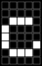
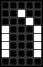
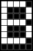

<!--
[](https://github.com/smdn/Smdn.Devices.US2066/blob/main/LICENSE.txt)
[](https://github.com/smdn/Smdn.Devices.US2066/issues)
[](https://www.nuget.org/packages/Smdn.Devices.US2066/)
-->

# Smdn.Devices.US2066
[Smdn.Devices.US2066](src/Smdn.Devices.US2066/) is a .NET library for controlling [WiseChip US2066](https://www.wisechip.com.tw/) OLED Driver with Controller.

This library enables you to control OLED character display modules which has US2066 controller chip.

The supported display modules are listed in [tested and supported display modules](#tested-and-supported-oled-display-modules).


## Hardware supports
`Smdn.Devices.US2066` is based on [Iot.Device.Bindings](https://www.nuget.org/packages/Iot.Device.Bindings/). This library enables you to control OLED character displays connected to the board like Raspberry Pi which `Iot.Device.Bindings` supports.

Also combined with the library [Smdn.Devices.MCP2221.GpioAdapter](https://github.com/smdn/Smdn.Devices.MCP2221), you can control the OLED displays via USB connection even on generic PCs without using the specific board like Arduino. See [MCP2221 example](examples/MCP2221/).

## Library API features
### `string` to `byte[]` conversion
`Smdn.Devices.US2066` can output `string`s directly. Symbols and non-ASCII characters are automatically converted to the appropriate `byte`s, and are displayed on the OLED display.

As an example, the `string` `"ÄÁΩ⏫￫"` will be displayed like     .

For more information about character mapping, see [this document](./doc/characters/).

(⚠The [character mapping of CGROM-B](./doc/characters/CGROM-B.md) and some other characters, especially alphabets with diacritical marks, are incomplete. Contributions are welcome!)

### Japanese and Russian conversion
`Smdn.Devices.US2066` also supports Japanese full-width Hiragana/Katakana to half-width Katakana conversion(全角かな/全角カナ→半角カナ変換), Russian lower case to upper case conversion.

As an example, the following `string`s will be displayed like below.

|`string`|Characters on display|
|--------|---------------------|
|`"こんにちは、せかい！"`||
|`"Привет, мир!"`||

See example of [helloworld-ja](examples/helloworld-ja/) and [helloworld-ru](examples/helloworld-ru/).

### Custom characters
`US2066` supports registering custom characters. `Smdn.Devices.US2066` can map custom characters to any characters including emojis on registration.

```cs
using Smdn.Devices.US2066;

using var display = SO1602A.Create(SO1602A.DefaultI2CAddress);

display.CGRamUsage = CGRamUsage.UserDefined6Characters;

// define and register a custom character, and map to the emoji
display.CreateCustomCharacter(
  CGRamCharacter.Character0,
  "🙂", // emoji for this custom character
  new byte[8] {
    0b_00000, // 🟪🟪🟪🟪🟪
    0b_01010, // 🟪🟨🟪🟨🟪
    0b_01010, // 🟪🟨🟪🟨🟪
    0b_00000, // 🟪🟪🟪🟪🟪
    0b_10001, // 🟨🟪🟪🟪🟨
    0b_01110, // 🟪🟨🟨🟨🟪
    0b_00000, // 🟪🟪🟪🟪🟪
    0b_00000, // 🟪🟪🟪🟪🟪
  }
);

// display the registered custom character by specifying mapped emoji
display.Write("🙂");
```

See example of [customcharacters](examples/customcharacters) for detail.


## Supported US2066 features/commands
- Interface
  - [ ] 4/b bit 6800/8080
  - [ ] SPI
  - [x] I<sup>2</sup>C
- Fundamental Command Set
  - [x] Clear Display
  - [x] Return Home
  - [ ] Entry Mode Set
  - [x] Display ON/OFF Control
  - [x] Extended Function Set
  - [ ] Cursor or Display Shift
  - [ ] Double Height / Display dot shift
  - [ ] Shift Enable
  - [ ] Scroll Enable
  - [x] Function Set
  - [x] Set CGRAM address
  - [x] Set DDRAM address
  - [ ] Set Scroll Quantity
  - [x] Read Busy Flag and Address/Part ID
    - not tested
  - [x] Write data
  - [x] Read data
    - not tested
- Extended Command Set
  - [ ] Function Selection A
  - [x] Function Selection B
  - [x] OLED Characterization
- OLED Command Set
  - [x] Set Contrast Control
  - [x] Set Display Clock Divide Ratio / Oscillator Frequency
  - [ ] Set Phase Length
  - [ ] Set SEG Pins Hardware Configuration
  - [ ] Set V<sub>COMH</sub> Deselect Level
  - [ ] Function Selection C
  - [x] Set Fade Out and Blinking

## Tested and supported OLED display modules
|Series                                                                                             |Model No.|Size |Image                                      |
|---------------------------------------------------------------------------------------------------|---------|-----|:-----------------------------------------:|
|[SUNLIKE DISPLAY SO Series](https://www.lcd-modules.com.tw/page/about/index.aspx?kind=27) (SOXXXXA)|SO1602A  |16×2||
|                                                                                                   |SO2002A  |20×2||

By deriving from the class [`US2066DisplayModuleBase`](src/Smdn.Devices.US2066/Smdn.Devices.US2066/US2066DisplayModuleBase.cs), other display modules can also be worked.

# Getting started and examples
Firstly, add package [Smdn.Devices.US2066](https://www.nuget.org/packages/Smdn.Devices.US2066/) to your project.

```
dotnet add package Smdn.Devices.US2066
```

Nextly, write your codes. The simpliest `Hello, world!` code is like below. This code uses the display module `SO1602A`.

```cs
using Smdn.Devices.US2066;

using var display = SO1602A.Create(SO1602A.DefaultI2CAddress);

display.Write("Hello, world!");
```

For detailed instructions, including wiring of the devices and parts, see [examples/helloworld](examples/helloworld/README.md).

More examples can be found in [examples](examples/) directory.
