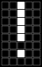
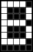
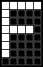
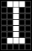
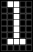
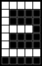
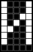
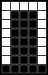
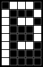
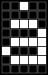

<!-- DO NOT MODIFY - Automatically generated file -->

# CGROM-B character table
Smdn.Devices.US2066 version 0.9.0.0 ([Smdn.Devices.US2066.CharacterGeneratorRomBEncoding](/src/Smdn.Devices.US2066/Smdn.Devices.US2066/encodings/))

|bitmap|`byte` expression|`char` expression|alternative `char` expression (if collation enabled)|
|------|--------------------|--------------------|-------------------------------------------------------|
||`0x00`|(`U+F800`)||
||`0x01`|(`U+F801`)||
||`0x02`|(`U+F802`)||
||`0x03`|(`U+F803`)||
||`0x04`|(`U+F804`)||
||`0x05`|(`U+F805`)||
||`0x06`|(`U+F806`)||
||`0x07`|(`U+F807`)||
||`0x08`|(`U+F808`)||
||`0x09`|(`U+F809`)||
||`0x0A`|(`U+F80A`)||
||`0x0B`|(`U+F80B`)||
||`0x0C`|(`U+F80C`)||
||`0x0D`|(`U+F80D`)||
||`0x0E`|(`U+F80E`)||
||`0x0F`|(`U+F80F`)||
||`0x10`|`▶` (`U+25B6`)|`⊳` (`U+22B3`) `⏴` (`U+23F4`) `▷` (`U+25B7`) `▸` (`U+25B8`) `▹` (`U+25B9`) `►` (`U+25BA`) `▻` (`U+25BB`)|
||`0x11`|`◀` (`U+25C0`)|`⊲` (`U+22B2`) `⏵` (`U+23F5`) `◁` (`U+25C1`) `◂` (`U+25C2`) `◃` (`U+25C3`) `◄` (`U+25C4`) `◅` (`U+25C5`)|
||`0x12`|`⏫` (`U+23EB`)||
||`0x13`|`⏬` (`U+23EC`)||
||`0x14`|`£` (`U+00A3`)|`㍀` (`U+3340`) `￡` (`U+FFE1`)|
||`0x15`|`¿` (`U+00BF`)||
||`0x16`|`¡` (`U+00A1`)||
||`0x17`|`♪` (`U+266A`)||
||`0x18`|(`U+E218`) ⚠have not mapped to certain character||
||`0x19`|(`U+E219`) ⚠have not mapped to certain character||
||`0x1A`|`✓` (`U+2713`)|`☑` (`U+2611`) `✔` (`U+2714`)|
||`0x1B`|(`U+F81B`)||
||`0x1C`|(`U+F81C`)||
||`0x1D`|(`U+F81D`)||
||`0x1E`|(`U+F81E`)||
||`0x1F`|(`U+F81F`)||
||`0x20`|` ` (`U+0020`)|`　` (`U+3000`)|
||`0x21`|`!` (`U+0021`)|`！` (`U+FF01`)|
||`0x22`|`"` (`U+0022`)|`＂` (`U+FF02`)|
||`0x23`|`#` (`U+0023`)|`＃` (`U+FF03`)|
||`0x24`|`$` (`U+0024`)|`㌦` (`U+3326`) `＄` (`U+FF04`) `＄` (`U+FF04`)|
||`0x25`|`%` (`U+0025`)|`％` (`U+FF05`)|
||`0x26`|`&` (`U+0026`)|`＆` (`U+FF06`)|
||`0x27`|`'` (`U+0027`)|`＇` (`U+FF07`)|
||`0x28`|`(` (`U+0028`)|`（` (`U+FF08`)|
||`0x29`|`)` (`U+0029`)|`）` (`U+FF09`)|
||`0x2A`|`*` (`U+002A`)|`＊` (`U+FF0A`)|
||`0x2B`|`+` (`U+002B`)|`＋` (`U+FF0B`)|
||`0x2C`|`,` (`U+002C`)|`，` (`U+FF0C`)|
||`0x2D`|`-` (`U+002D`)|`－` (`U+FF0D`)|
||`0x2E`|`.` (`U+002E`)|`．` (`U+FF0E`)|
||`0x2F`|`/` (`U+002F`)|`／` (`U+FF0F`)|
||`0x30`|`0` (`U+0030`)|`０` (`U+FF10`)|
||`0x31`|`1` (`U+0031`)|`１` (`U+FF11`)|
||`0x32`|`2` (`U+0032`)|`２` (`U+FF12`)|
||`0x33`|`3` (`U+0033`)|`３` (`U+FF13`)|
||`0x34`|`4` (`U+0034`)|`４` (`U+FF14`)|
||`0x35`|`5` (`U+0035`)|`５` (`U+FF15`)|
||`0x36`|`6` (`U+0036`)|`６` (`U+FF16`)|
||`0x37`|`7` (`U+0037`)|`７` (`U+FF17`)|
||`0x38`|`8` (`U+0038`)|`８` (`U+FF18`)|
||`0x39`|`9` (`U+0039`)|`９` (`U+FF19`)|
||`0x3A`|`:` (`U+003A`)|`：` (`U+FF1A`)|
||`0x3B`|`;` (`U+003B`)|`；` (`U+FF1B`)|
||`0x3C`|`<` (`U+003C`)|`＜` (`U+FF1C`) `＞` (`U+FF1E`)|
||`0x3D`|`=` (`U+003D`)|`＝` (`U+FF1D`)|
||`0x3E`|`>` (`U+003E`)||
||`0x3F`|`?` (`U+003F`)|`？` (`U+FF1F`)|
||`0x40`|`@` (`U+0040`)|`＠` (`U+FF20`)|
||`0x41`|`A` (`U+0041`)|`Ａ` (`U+FF21`)|
||`0x42`|`B` (`U+0042`)|`Ｂ` (`U+FF22`)|
||`0x43`|`C` (`U+0043`)|`Ｃ` (`U+FF23`)|
||`0x44`|`D` (`U+0044`)|`Ｄ` (`U+FF24`)|
||`0x45`|`E` (`U+0045`)|`Ｅ` (`U+FF25`)|
||`0x46`|`F` (`U+0046`)|`Ｆ` (`U+FF26`)|
||`0x47`|`G` (`U+0047`)|`Ｇ` (`U+FF27`)|
||`0x48`|`H` (`U+0048`)|`Ｈ` (`U+FF28`)|
||`0x49`|`I` (`U+0049`)|`Ｉ` (`U+FF29`)|
||`0x4A`|`J` (`U+004A`)|`Ｊ` (`U+FF2A`)|
||`0x4B`|`K` (`U+004B`)|`Ｋ` (`U+FF2B`)|
||`0x4C`|`L` (`U+004C`)|`Ｌ` (`U+FF2C`)|
||`0x4D`|`M` (`U+004D`)|`Ｍ` (`U+FF2D`)|
||`0x4E`|`N` (`U+004E`)|`Ｎ` (`U+FF2E`)|
||`0x4F`|`O` (`U+004F`)|`Ｏ` (`U+FF2F`)|
||`0x50`|`P` (`U+0050`)|`Ｐ` (`U+FF30`)|
||`0x51`|`Q` (`U+0051`)|`Ｑ` (`U+FF31`)|
||`0x52`|`R` (`U+0052`)|`Ｒ` (`U+FF32`)|
||`0x53`|`S` (`U+0053`)|`Ｓ` (`U+FF33`)|
||`0x54`|`T` (`U+0054`)|`Ｔ` (`U+FF34`)|
||`0x55`|`U` (`U+0055`)|`Ｕ` (`U+FF35`)|
||`0x56`|`V` (`U+0056`)|`Ｖ` (`U+FF36`)|
||`0x57`|`W` (`U+0057`)|`Ｗ` (`U+FF37`)|
||`0x58`|`X` (`U+0058`)|`Ｘ` (`U+FF38`)|
||`0x59`|`Y` (`U+0059`)|`Ｙ` (`U+FF39`)|
||`0x5A`|`Z` (`U+005A`)|`Ｚ` (`U+FF3A`)|
||`0x5B`|`[` (`U+005B`)|`［` (`U+FF3B`)|
||`0x5C`|`\` (`U+005C`)|`＼` (`U+FF3C`)|
||`0x5D`|`]` (`U+005D`)|`］` (`U+FF3D`)|
||`0x5E`|`^` (`U+005E`)|`＾` (`U+FF3E`)|
||`0x5F`|`_` (`U+005F`)|`＿` (`U+FF3F`)|
||`0x60`|`&#x60;` (`U+0060`)|`｀` (`U+FF40`)|
||`0x61`|`a` (`U+0061`)|`ａ` (`U+FF41`)|
||`0x62`|`b` (`U+0062`)|`ｂ` (`U+FF42`)|
||`0x63`|`c` (`U+0063`)|`ｃ` (`U+FF43`)|
||`0x64`|`d` (`U+0064`)|`ｄ` (`U+FF44`)|
||`0x65`|`e` (`U+0065`)|`ｅ` (`U+FF45`)|
||`0x66`|`f` (`U+0066`)|`ｆ` (`U+FF46`)|
||`0x67`|`g` (`U+0067`)|`ｇ` (`U+FF47`)|
||`0x68`|`h` (`U+0068`)|`ｈ` (`U+FF48`)|
||`0x69`|`i` (`U+0069`)|`ｉ` (`U+FF49`)|
||`0x6A`|`j` (`U+006A`)|`ｊ` (`U+FF4A`)|
||`0x6B`|`k` (`U+006B`)|`ｋ` (`U+FF4B`)|
||`0x6C`|`l` (`U+006C`)|`ｌ` (`U+FF4C`)|
||`0x6D`|`m` (`U+006D`)|`ｍ` (`U+FF4D`)|
||`0x6E`|`n` (`U+006E`)|`ｎ` (`U+FF4E`)|
||`0x6F`|`o` (`U+006F`)|`ｏ` (`U+FF4F`)|
||`0x70`|`p` (`U+0070`)|`ｐ` (`U+FF50`)|
||`0x71`|`q` (`U+0071`)|`ｑ` (`U+FF51`)|
||`0x72`|`r` (`U+0072`)|`ｒ` (`U+FF52`)|
||`0x73`|`s` (`U+0073`)|`ｓ` (`U+FF53`)|
||`0x74`|`t` (`U+0074`)|`ｔ` (`U+FF54`)|
||`0x75`|`u` (`U+0075`)|`ｕ` (`U+FF55`)|
||`0x76`|`v` (`U+0076`)|`ｖ` (`U+FF56`)|
||`0x77`|`w` (`U+0077`)|`ｗ` (`U+FF57`)|
||`0x78`|`x` (`U+0078`)|`ｘ` (`U+FF58`)|
||`0x79`|`y` (`U+0079`)|`ｙ` (`U+FF59`)|
||`0x7A`|`z` (`U+007A`)|`ｚ` (`U+FF5A`)|
||`0x7B`|`{` (`U+007B`)|`｛` (`U+FF5B`)|
||`0x7C`|`&#x7C;` (`U+007C`)|`｜` (`U+FF5C`)|
||`0x7D`|`}` (`U+007D`)|`｝` (`U+FF5D`)|
||`0x7E`|`~` (`U+007E`)|`～` (`U+FF5E`)|
||`0x7F`|`¦` (`U+00A6`)|`⋮` (`U+22EE`) `︙` (`U+FE19`) `￤` (`U+FFE4`)|
||`0x80`|`А` (`U+0410`)||
||`0x81`|`Б` (`U+0411`)||
||`0x82`|`В` (`U+0412`)||
||`0x83`|`Г` (`U+0413`)||
||`0x84`|`Д` (`U+0414`)||
||`0x85`|`Е` (`U+0415`)||
||`0x86`|`Ж` (`U+0416`)||
||`0x87`|`З` (`U+0417`)||
||`0x88`|`И` (`U+0418`)||
||`0x89`|`Й` (`U+0419`)||
||`0x8A`|`К` (`U+041A`)||
||`0x8B`|`Л` (`U+041B`)||
||`0x8C`|`М` (`U+041C`)||
||`0x8D`|`Н` (`U+041D`)||
||`0x8E`|`О` (`U+041E`)||
||`0x8F`|`П` (`U+041F`)||
||`0x90`|`Р` (`U+0420`)||
||`0x91`|`С` (`U+0421`)||
||`0x92`|`Т` (`U+0422`)||
||`0x93`|`У` (`U+0423`)||
||`0x94`|`Ф` (`U+0424`)||
||`0x95`|`Х` (`U+0425`)||
||`0x96`|`Ц` (`U+0426`)||
||`0x97`|`Ч` (`U+0427`)||
||`0x98`|`Ш` (`U+0428`)||
||`0x99`|`Щ` (`U+0429`)||
||`0x9A`|`Ъ` (`U+042A`)||
||`0x9B`|`Ы` (`U+042B`)||
||`0x9C`|`Ь` (`U+042C`)||
||`0x9D`|`Э` (`U+042D`)||
||`0x9E`|`Ю` (`U+042E`)||
||`0x9F`|`Я` (`U+042F`)||
||`0xA0`|(`U+E2A0`) ⚠have not mapped to certain character||
||`0xA1`|(`U+E2A1`) ⚠have not mapped to certain character||
||`0xA2`|(`U+E2A2`) ⚠have not mapped to certain character||
||`0xA3`|(`U+E2A3`) ⚠have not mapped to certain character||
||`0xA4`|(`U+E2A4`) ⚠have not mapped to certain character||
||`0xA5`|(`U+E2A5`) ⚠have not mapped to certain character||
||`0xA6`|(`U+E2A6`) ⚠have not mapped to certain character||
||`0xA7`|(`U+E2A7`) ⚠have not mapped to certain character||
||`0xA8`|(`U+E2A8`) ⚠have not mapped to certain character||
||`0xA9`|(`U+E2A9`) ⚠have not mapped to certain character||
||`0xAA`|(`U+E2AA`) ⚠have not mapped to certain character||
||`0xAB`|(`U+E2AB`) ⚠have not mapped to certain character||
||`0xAC`|(`U+E2AC`) ⚠have not mapped to certain character||
||`0xAD`|(`U+E2AD`) ⚠have not mapped to certain character||
||`0xAE`|(`U+E2AE`) ⚠have not mapped to certain character||
||`0xAF`|(`U+E2AF`) ⚠have not mapped to certain character||
||`0xB0`|(`U+E2B0`) ⚠have not mapped to certain character||
||`0xB1`|(`U+E2B1`) ⚠have not mapped to certain character||
||`0xB2`|(`U+E2B2`) ⚠have not mapped to certain character||
||`0xB3`|(`U+E2B3`) ⚠have not mapped to certain character||
||`0xB4`|(`U+E2B4`) ⚠have not mapped to certain character||
||`0xB5`|(`U+E2B5`) ⚠have not mapped to certain character||
||`0xB6`|(`U+E2B6`) ⚠have not mapped to certain character||
||`0xB7`|(`U+E2B7`) ⚠have not mapped to certain character||
||`0xB8`|(`U+E2B8`) ⚠have not mapped to certain character||
||`0xB9`|(`U+E2B9`) ⚠have not mapped to certain character||
||`0xBA`|(`U+E2BA`) ⚠have not mapped to certain character||
||`0xBB`|(`U+F8BB`)||
||`0xBC`|(`U+F8BC`)||
||`0xBD`|(`U+F8BD`)||
||`0xBE`|(`U+F8BE`)||
||`0xBF`|(`U+F8BF`)||
||`0xC0`|(`U+E2C0`) ⚠have not mapped to certain character||
||`0xC1`|(`U+E2C1`) ⚠have not mapped to certain character||
||`0xC2`|(`U+E2C2`) ⚠have not mapped to certain character||
||`0xC3`|(`U+E2C3`) ⚠have not mapped to certain character||
||`0xC4`|(`U+E2C4`) ⚠have not mapped to certain character||
||`0xC5`|(`U+E2C5`) ⚠have not mapped to certain character||
||`0xC6`|(`U+E2C6`) ⚠have not mapped to certain character||
||`0xC7`|(`U+E2C7`) ⚠have not mapped to certain character||
||`0xC8`|(`U+E2C8`) ⚠have not mapped to certain character||
||`0xC9`|(`U+E2C9`) ⚠have not mapped to certain character||
||`0xCA`|(`U+E2CA`) ⚠have not mapped to certain character||
||`0xCB`|(`U+E2CB`) ⚠have not mapped to certain character||
||`0xCC`|(`U+E2CC`) ⚠have not mapped to certain character||
||`0xCD`|(`U+E2CD`) ⚠have not mapped to certain character||
||`0xCE`|(`U+E2CE`) ⚠have not mapped to certain character||
||`0xCF`|(`U+E2CF`) ⚠have not mapped to certain character||
||`0xD0`|(`U+E2D0`) ⚠have not mapped to certain character||
||`0xD1`|(`U+E2D1`) ⚠have not mapped to certain character||
||`0xD2`|(`U+E2D2`) ⚠have not mapped to certain character||
||`0xD3`|(`U+E2D3`) ⚠have not mapped to certain character||
||`0xD4`|(`U+E2D4`) ⚠have not mapped to certain character||
||`0xD5`|(`U+E2D5`) ⚠have not mapped to certain character||
||`0xD6`|(`U+E2D6`) ⚠have not mapped to certain character||
||`0xD7`|`×` (`U+00D7`)||
||`0xD8`|(`U+E2D8`) ⚠have not mapped to certain character||
||`0xD9`|(`U+E2D9`) ⚠have not mapped to certain character||
||`0xDA`|(`U+E2DA`) ⚠have not mapped to certain character||
||`0xDB`|(`U+E2DB`) ⚠have not mapped to certain character||
||`0xDC`|(`U+E2DC`) ⚠have not mapped to certain character||
||`0xDD`|(`U+E2DD`) ⚠have not mapped to certain character||
||`0xDE`|(`U+E2DE`) ⚠have not mapped to certain character||
||`0xDF`|`ß` (`U+00DF`)||
||`0xE0`|(`U+E2E0`) ⚠have not mapped to certain character||
||`0xE1`|(`U+E2E1`) ⚠have not mapped to certain character||
||`0xE2`|(`U+E2E2`) ⚠have not mapped to certain character||
||`0xE3`|(`U+E2E3`) ⚠have not mapped to certain character||
||`0xE4`|(`U+E2E4`) ⚠have not mapped to certain character||
||`0xE5`|(`U+E2E5`) ⚠have not mapped to certain character||
||`0xE6`|(`U+E2E6`) ⚠have not mapped to certain character||
||`0xE7`|(`U+E2E7`) ⚠have not mapped to certain character||
||`0xE8`|(`U+E2E8`) ⚠have not mapped to certain character||
||`0xE9`|(`U+E2E9`) ⚠have not mapped to certain character||
||`0xEA`|(`U+E2EA`) ⚠have not mapped to certain character||
||`0xEB`|(`U+E2EB`) ⚠have not mapped to certain character||
||`0xEC`|(`U+E2EC`) ⚠have not mapped to certain character||
||`0xED`|(`U+E2ED`) ⚠have not mapped to certain character||
||`0xEE`|(`U+E2EE`) ⚠have not mapped to certain character||
||`0xEF`|(`U+E2EF`) ⚠have not mapped to certain character||
||`0xF0`|(`U+E2F0`) ⚠have not mapped to certain character||
||`0xF1`|(`U+E2F1`) ⚠have not mapped to certain character||
||`0xF2`|(`U+E2F2`) ⚠have not mapped to certain character||
||`0xF3`|(`U+E2F3`) ⚠have not mapped to certain character||
||`0xF4`|(`U+E2F4`) ⚠have not mapped to certain character||
||`0xF5`|(`U+E2F5`) ⚠have not mapped to certain character||
||`0xF6`|(`U+E2F6`) ⚠have not mapped to certain character||
||`0xF7`|`÷` (`U+00F7`)||
||`0xF8`|(`U+E2F8`) ⚠have not mapped to certain character||
||`0xF9`|(`U+E2F9`) ⚠have not mapped to certain character||
||`0xFA`|(`U+E2FA`) ⚠have not mapped to certain character||
||`0xFB`|(`U+E2FB`) ⚠have not mapped to certain character||
||`0xFC`|(`U+E2FC`) ⚠have not mapped to certain character||
||`0xFD`|(`U+E2FD`) ⚠have not mapped to certain character||
||`0xFE`|(`U+E2FE`) ⚠have not mapped to certain character||
||`0xFF`|(`U+E2FF`) ⚠have not mapped to certain character||
