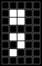
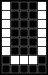

<!-- DO NOT MODIFY - Automatically generated file -->

# CGROM-C character table
Smdn.Devices.US2066 version 0.9.0.0 ([Smdn.Devices.US2066.CharacterGeneratorRomCEncoding](/src/Smdn.Devices.US2066/Smdn.Devices.US2066/encodings/))

|bitmap|`byte` expression|`char` expression|alternative `char` expression (if collation enabled)|
|------|--------------------|--------------------|-------------------------------------------------------|
||`0x00`|`⌠` (`U+2320`)||
||`0x01`|`⌡` (`U+2321`)||
||`0x02`|`∞` (`U+221E`)||
||`0x03`|`∇` (`U+2207`)||
||`0x04`|`↵` (`U+21B5`)|`↲` (`U+21B2`) `⏎` (`U+23CE`)|
||`0x05`|`￪` (`U+FFEA`)|`↑` (`U+2191`) `⇧` (`U+21E7`)|
||`0x06`|`￬` (`U+FFEC`)|`↓` (`U+2193`) `⇩` (`U+21E9`)|
||`0x07`|`￫` (`U+FFEB`)|`→` (`U+2192`) `⇨` (`U+21E8`)|
||`0x08`|`￩` (`U+FFE9`)|`←` (`U+2190`) `⇦` (`U+21E6`)|
||`0x09`|`┌` (`U+250C`)|`┏` (`U+250F`) `╔` (`U+2554`)|
||`0x0A`|`┐` (`U+2510`)|`┓` (`U+2513`) `╗` (`U+2557`)|
||`0x0B`|`└` (`U+2514`)|`┗` (`U+2517`) `╚` (`U+255A`)|
||`0x0C`|`┘` (`U+2518`)|`┛` (`U+251B`) `╝` (`U+255D`)|
||`0x0D`|`･` (`U+FF65`)|`・` (`U+30FB`)|
||`0x0E`|`®` (`U+00AE`)||
||`0x0F`|`©` (`U+00A9`)||
||`0x10`|`™` (`U+2122`)||
||`0x11`|`†` (`U+2020`)||
||`0x12`|`§` (`U+00A7`)||
||`0x13`|`¶` (`U+00B6`)||
||`0x14`|`Γ` (`U+0393`)||
||`0x15`|`Δ` (`U+0394`)||
||`0x16`|`Θ` (`U+0398`)||
||`0x17`|`Λ` (`U+039B`)||
||`0x18`|`Ξ` (`U+039E`)||
||`0x19`|`Π` (`U+03A0`)||
||`0x1A`|`Σ` (`U+03A3`)|`∑` (`U+2211`)|
||`0x1B`|`Υ` (`U+03A5`)||
||`0x1C`|`Φ` (`U+03A6`)||
||`0x1D`|`Ψ` (`U+03A8`)||
||`0x1E`|`Ω` (`U+03A9`)||
||`0x1F`|`α` (`U+03B1`)||
||`0x20`|` ` (`U+0020`)|`　` (`U+3000`)|
||`0x21`|`!` (`U+0021`)|`！` (`U+FF01`)|
||`0x22`|`"` (`U+0022`)|`＂` (`U+FF02`)|
||`0x23`|`#` (`U+0023`)|`＃` (`U+FF03`)|
||`0x24`|`$` (`U+0024`)|`㌦` (`U+3326`) `＄` (`U+FF04`) `＄` (`U+FF04`)|
||`0x25`|`%` (`U+0025`)|`％` (`U+FF05`)|
||`0x26`|`&` (`U+0026`)|`＆` (`U+FF06`)|
||`0x27`|`'` (`U+0027`)|`＇` (`U+FF07`)|
||`0x28`|`(` (`U+0028`)|`（` (`U+FF08`)|
||`0x29`|`)` (`U+0029`)|`）` (`U+FF09`)|
||`0x2A`|`*` (`U+002A`)|`＊` (`U+FF0A`)|
||`0x2B`|`+` (`U+002B`)|`＋` (`U+FF0B`)|
||`0x2C`|`,` (`U+002C`)|`，` (`U+FF0C`)|
||`0x2D`|`-` (`U+002D`)|`－` (`U+FF0D`)|
||`0x2E`|`.` (`U+002E`)|`．` (`U+FF0E`)|
||`0x2F`|`/` (`U+002F`)|`／` (`U+FF0F`)|
||`0x30`|`0` (`U+0030`)|`０` (`U+FF10`)|
||`0x31`|`1` (`U+0031`)|`１` (`U+FF11`)|
||`0x32`|`2` (`U+0032`)|`２` (`U+FF12`)|
||`0x33`|`3` (`U+0033`)|`３` (`U+FF13`)|
||`0x34`|`4` (`U+0034`)|`４` (`U+FF14`)|
||`0x35`|`5` (`U+0035`)|`５` (`U+FF15`)|
||`0x36`|`6` (`U+0036`)|`６` (`U+FF16`)|
||`0x37`|`7` (`U+0037`)|`７` (`U+FF17`)|
||`0x38`|`8` (`U+0038`)|`８` (`U+FF18`)|
||`0x39`|`9` (`U+0039`)|`９` (`U+FF19`)|
||`0x3A`|`:` (`U+003A`)|`：` (`U+FF1A`)|
||`0x3B`|`;` (`U+003B`)|`；` (`U+FF1B`)|
||`0x3C`|`<` (`U+003C`)|`＜` (`U+FF1C`) `＞` (`U+FF1E`)|
||`0x3D`|`=` (`U+003D`)|`＝` (`U+FF1D`)|
||`0x3E`|`>` (`U+003E`)||
||`0x3F`|`?` (`U+003F`)|`？` (`U+FF1F`)|
||`0x40`|`@` (`U+0040`)|`＠` (`U+FF20`)|
||`0x41`|`A` (`U+0041`)|`Ａ` (`U+FF21`)|
||`0x42`|`B` (`U+0042`)|`Ｂ` (`U+FF22`)|
||`0x43`|`C` (`U+0043`)|`Ｃ` (`U+FF23`)|
||`0x44`|`D` (`U+0044`)|`Ｄ` (`U+FF24`)|
||`0x45`|`E` (`U+0045`)|`Ｅ` (`U+FF25`)|
||`0x46`|`F` (`U+0046`)|`Ｆ` (`U+FF26`)|
||`0x47`|`G` (`U+0047`)|`Ｇ` (`U+FF27`)|
||`0x48`|`H` (`U+0048`)|`Ｈ` (`U+FF28`)|
||`0x49`|`I` (`U+0049`)|`Ｉ` (`U+FF29`)|
||`0x4A`|`J` (`U+004A`)|`Ｊ` (`U+FF2A`)|
||`0x4B`|`K` (`U+004B`)|`Ｋ` (`U+FF2B`)|
||`0x4C`|`L` (`U+004C`)|`Ｌ` (`U+FF2C`)|
||`0x4D`|`M` (`U+004D`)|`Ｍ` (`U+FF2D`)|
||`0x4E`|`N` (`U+004E`)|`Ｎ` (`U+FF2E`)|
||`0x4F`|`O` (`U+004F`)|`Ｏ` (`U+FF2F`)|
||`0x50`|`P` (`U+0050`)|`Ｐ` (`U+FF30`)|
||`0x51`|`Q` (`U+0051`)|`Ｑ` (`U+FF31`)|
||`0x52`|`R` (`U+0052`)|`Ｒ` (`U+FF32`)|
||`0x53`|`S` (`U+0053`)|`Ｓ` (`U+FF33`)|
||`0x54`|`T` (`U+0054`)|`Ｔ` (`U+FF34`)|
||`0x55`|`U` (`U+0055`)|`Ｕ` (`U+FF35`)|
||`0x56`|`V` (`U+0056`)|`Ｖ` (`U+FF36`)|
||`0x57`|`W` (`U+0057`)|`Ｗ` (`U+FF37`)|
||`0x58`|`X` (`U+0058`)|`Ｘ` (`U+FF38`)|
||`0x59`|`Y` (`U+0059`)|`Ｙ` (`U+FF39`)|
||`0x5A`|`Z` (`U+005A`)|`Ｚ` (`U+FF3A`)|
||`0x5B`|`[` (`U+005B`)|`［` (`U+FF3B`)|
||`0x5C`|`\` (`U+005C`)|`＼` (`U+FF3C`)|
||`0x5D`|`]` (`U+005D`)|`］` (`U+FF3D`)|
||`0x5E`|`^` (`U+005E`)|`＾` (`U+FF3E`)|
||`0x5F`|`_` (`U+005F`)|`＿` (`U+FF3F`)|
||`0x60`|`&#x60;` (`U+0060`)|`｀` (`U+FF40`)|
||`0x61`|`a` (`U+0061`)|`ａ` (`U+FF41`)|
||`0x62`|`b` (`U+0062`)|`ｂ` (`U+FF42`)|
||`0x63`|`c` (`U+0063`)|`ｃ` (`U+FF43`)|
||`0x64`|`d` (`U+0064`)|`ｄ` (`U+FF44`)|
||`0x65`|`e` (`U+0065`)|`ｅ` (`U+FF45`)|
||`0x66`|`f` (`U+0066`)|`ｆ` (`U+FF46`)|
||`0x67`|`g` (`U+0067`)|`ｇ` (`U+FF47`)|
||`0x68`|`h` (`U+0068`)|`ｈ` (`U+FF48`)|
||`0x69`|`i` (`U+0069`)|`ｉ` (`U+FF49`)|
||`0x6A`|`j` (`U+006A`)|`ｊ` (`U+FF4A`)|
||`0x6B`|`k` (`U+006B`)|`ｋ` (`U+FF4B`)|
||`0x6C`|`l` (`U+006C`)|`ｌ` (`U+FF4C`)|
||`0x6D`|`m` (`U+006D`)|`ｍ` (`U+FF4D`)|
||`0x6E`|`n` (`U+006E`)|`ｎ` (`U+FF4E`)|
||`0x6F`|`o` (`U+006F`)|`ｏ` (`U+FF4F`)|
||`0x70`|`p` (`U+0070`)|`ｐ` (`U+FF50`)|
||`0x71`|`q` (`U+0071`)|`ｑ` (`U+FF51`)|
||`0x72`|`r` (`U+0072`)|`ｒ` (`U+FF52`)|
||`0x73`|`s` (`U+0073`)|`ｓ` (`U+FF53`)|
||`0x74`|`t` (`U+0074`)|`ｔ` (`U+FF54`)|
||`0x75`|`u` (`U+0075`)|`ｕ` (`U+FF55`)|
||`0x76`|`v` (`U+0076`)|`ｖ` (`U+FF56`)|
||`0x77`|`w` (`U+0077`)|`ｗ` (`U+FF57`)|
||`0x78`|`x` (`U+0078`)|`ｘ` (`U+FF58`)|
||`0x79`|`y` (`U+0079`)|`ｙ` (`U+FF59`)|
||`0x7A`|`z` (`U+007A`)|`ｚ` (`U+FF5A`)|
||`0x7B`|`{` (`U+007B`)|`｛` (`U+FF5B`)|
||`0x7C`|`&#x7C;` (`U+007C`)|`｜` (`U+FF5C`)|
||`0x7D`|`}` (`U+007D`)|`｝` (`U+FF5D`)|
||`0x7E`|`￫` (`U+FFEB`)|`→` (`U+2192`) `⇨` (`U+21E8`)|
||`0x7F`|`￩` (`U+FFE9`)|`←` (`U+2190`) `⇦` (`U+21E6`)|
||`0x80`|`Ç` (`U+00C7`)||
||`0x81`|`ü` (`U+00FC`)||
||`0x82`|`é` (`U+00E9`)||
||`0x83`|`ȧ` (`U+0227`)||
||`0x84`|`ä` (`U+00E4`)||
||`0x85`|`à` (`U+00E0`)||
||`0x86`|`ȧ` (`U+0227`)||
||`0x87`|`ç` (`U+00E7`)||
||`0x88`|`ê` (`U+00EA`)||
||`0x89`|`ë` (`U+00EB`)||
||`0x8A`|`è` (`U+00E8`)||
||`0x8B`|`ï` (`U+00EF`)||
||`0x8C`|`î` (`U+00EE`)||
||`0x8D`|`ì` (`U+00EC`)||
||`0x8E`|`Ä` (`U+00C4`)||
||`0x8F`|`Â` (`U+00C2`)||
||`0x90`|`É` (`U+00C9`)||
||`0x91`|`æ` (`U+00E6`)||
||`0x92`|`Æ` (`U+00C6`)||
||`0x93`|`ô` (`U+00F4`)||
||`0x94`|`ö` (`U+00F6`)||
||`0x95`|`ò` (`U+00F2`)||
||`0x96`|`û` (`U+00FB`)||
||`0x97`|`ù` (`U+00F9`)||
||`0x98`|`ÿ` (`U+00FF`)||
||`0x99`|`Ö` (`U+00D6`)||
||`0x9A`|`Ü` (`U+00DC`)||
||`0x9B`|`ñ` (`U+00F1`)||
||`0x9C`|`Ñ` (`U+00D1`)||
||`0x9D`|(`U+E29D`) ⚠have not mapped to certain character||
||`0x9E`|(`U+E29E`) ⚠have not mapped to certain character||
||`0x9F`|`¿` (`U+00BF`)||
||`0xA0`|(`U+F8A0`)||
||`0xA1`|`｡` (`U+FF61`)|`。` (`U+3002`)|
||`0xA2`|`｢` (`U+FF62`)|`「` (`U+300C`)|
||`0xA3`|`｣` (`U+FF63`)|`」` (`U+300D`)|
||`0xA4`|`､` (`U+FF64`)|`、` (`U+3001`)|
||`0xA5`|`･` (`U+FF65`)|`・` (`U+30FB`)|
||`0xA6`|`ｦ` (`U+FF66`)||
||`0xA7`|`ｧ` (`U+FF67`)||
||`0xA8`|`ｨ` (`U+FF68`)||
||`0xA9`|`ｩ` (`U+FF69`)||
||`0xAA`|`ｪ` (`U+FF6A`)||
||`0xAB`|`ｫ` (`U+FF6B`)||
||`0xAC`|`ｬ` (`U+FF6C`)||
||`0xAD`|`ｭ` (`U+FF6D`)||
||`0xAE`|`ｮ` (`U+FF6E`)||
||`0xAF`|`ｯ` (`U+FF6F`)||
||`0xB0`|`ｰ` (`U+FF70`)||
||`0xB1`|`ｱ` (`U+FF71`)||
||`0xB2`|`ｲ` (`U+FF72`)||
||`0xB3`|`ｳ` (`U+FF73`)||
||`0xB4`|`ｴ` (`U+FF74`)||
||`0xB5`|`ｵ` (`U+FF75`)||
||`0xB6`|`ｶ` (`U+FF76`)||
||`0xB7`|`ｷ` (`U+FF77`)||
||`0xB8`|`ｸ` (`U+FF78`)||
||`0xB9`|`ｹ` (`U+FF79`)||
||`0xBA`|`ｺ` (`U+FF7A`)||
||`0xBB`|`ｻ` (`U+FF7B`)||
||`0xBC`|`ｼ` (`U+FF7C`)||
||`0xBD`|`ｽ` (`U+FF7D`)||
||`0xBE`|`ｾ` (`U+FF7E`)||
||`0xBF`|`ｿ` (`U+FF7F`)||
||`0xC0`|`ﾀ` (`U+FF80`)||
||`0xC1`|`ﾁ` (`U+FF81`)||
||`0xC2`|`ﾂ` (`U+FF82`)||
||`0xC3`|`ﾃ` (`U+FF83`)||
||`0xC4`|`ﾄ` (`U+FF84`)||
||`0xC5`|`ﾅ` (`U+FF85`)||
||`0xC6`|`ﾆ` (`U+FF86`)||
||`0xC7`|`ﾇ` (`U+FF87`)||
||`0xC8`|`ﾈ` (`U+FF88`)||
||`0xC9`|`ﾉ` (`U+FF89`)||
||`0xCA`|`ﾊ` (`U+FF8A`)||
||`0xCB`|`ﾋ` (`U+FF8B`)||
||`0xCC`|`ﾌ` (`U+FF8C`)||
||`0xCD`|`ﾍ` (`U+FF8D`)||
||`0xCE`|`ﾎ` (`U+FF8E`)||
||`0xCF`|`ﾏ` (`U+FF8F`)||
||`0xD0`|`ﾐ` (`U+FF90`)||
||`0xD1`|`ﾑ` (`U+FF91`)||
||`0xD2`|`ﾒ` (`U+FF92`)||
||`0xD3`|`ﾓ` (`U+FF93`)||
||`0xD4`|`ﾔ` (`U+FF94`)||
||`0xD5`|`ﾕ` (`U+FF95`)||
||`0xD6`|`ﾖ` (`U+FF96`)||
||`0xD7`|`ﾗ` (`U+FF97`)||
||`0xD8`|`ﾘ` (`U+FF98`)||
||`0xD9`|`ﾙ` (`U+FF99`)||
||`0xDA`|`ﾚ` (`U+FF9A`)||
||`0xDB`|`ﾛ` (`U+FF9B`)||
||`0xDC`|`ﾜ` (`U+FF9C`)||
||`0xDD`|`ﾝ` (`U+FF9D`)||
||`0xDE`|`ﾞ` (`U+FF9E`)||
||`0xDF`|`ﾟ` (`U+FF9F`)||
||`0xE0`|`á` (`U+00E1`)||
||`0xE1`|`í` (`U+00ED`)||
||`0xE2`|`ó` (`U+00F3`)||
||`0xE3`|`ú` (`U+00FA`)||
||`0xE4`|`¢` (`U+00A2`)|`㌣` (`U+3323`) `￠` (`U+FFE0`)|
||`0xE5`|`£` (`U+00A3`)|`㍀` (`U+3340`) `￡` (`U+FFE1`)|
||`0xE6`|`¥` (`U+00A5`)|`￥` (`U+FFE5`)|
||`0xE7`|`㌮` (`U+332E`)||
||`0xE8`|`ƒ` (`U+0192`)||
||`0xE9`|(`U+E2E9`) ⚠have not mapped to certain character||
||`0xEA`|`Ã` (`U+00C3`)||
||`0xEB`|`ã` (`U+00E3`)||
||`0xEC`|`Õ` (`U+00D5`)||
||`0xED`|`õ` (`U+00F5`)||
||`0xEE`|`Ø` (`U+00D8`)||
||`0xEF`|`ø` (`U+00F8`)||
||`0xF0`|`˙` (`U+02D9`)||
||`0xF1`|`¨` (`U+00A8`)||
||`0xF2`|`˚` (`U+02DA`)||
||`0xF3`|`ˋ` (`U+02CB`)||
||`0xF4`|`´` (`U+00B4`)|`ˊ` (`U+02CA`)|
||`0xF5`|`½` (`U+00BD`)||
||`0xF6`|`¼` (`U+00BC`)||
||`0xF7`|`×` (`U+00D7`)||
||`0xF8`|`÷` (`U+00F7`)||
||`0xF9`|`≥` (`U+2265`)|`≧` (`U+2267`) `⩾` (`U+2A7E`)|
||`0xFA`|`≤` (`U+2264`)|`≦` (`U+2266`) `⩽` (`U+2A7D`)|
||`0xFB`|`≪` (`U+226A`)||
||`0xFC`|`≫` (`U+226B`)||
||`0xFD`|`≠` (`U+2260`)||
||`0xFE`|`√` (`U+221A`)||
||`0xFF`|`‾` (`U+203E`)|`￣` (`U+FFE3`)|
