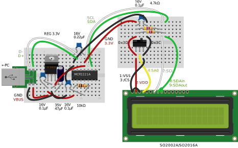
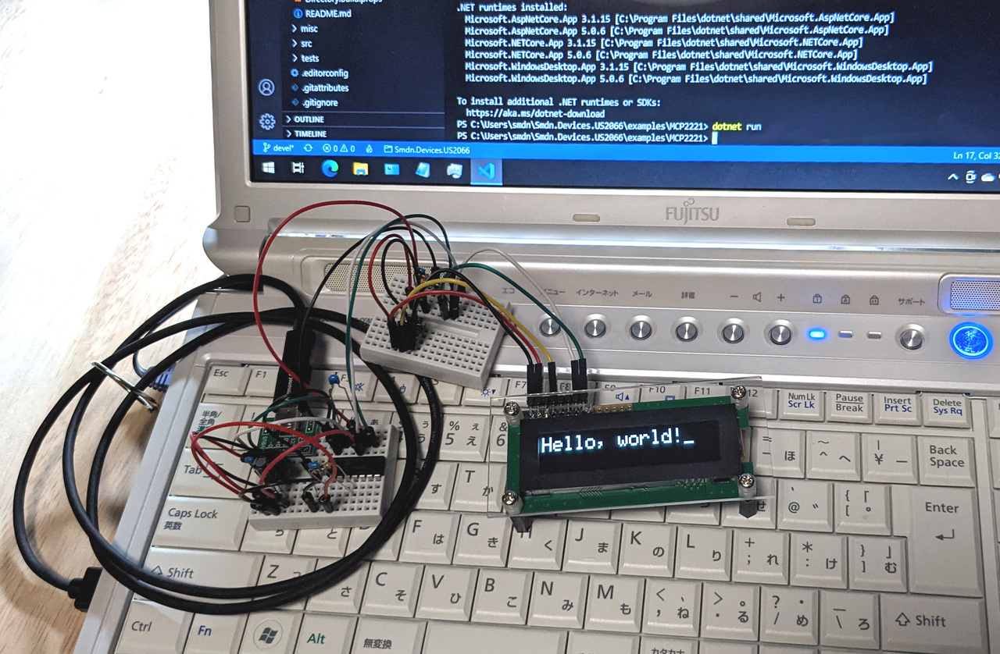

# MCP2221/MCP2221A
The IC MCP2221/MCP2221A is an interface converter that performs protocol conversion from USB to I2C.

This IC can send I2C commands via the USB HID interface, so you can operate I2C devices from generic PCs. There is no need to bring any special devices such as Arduino or Raspberry Pi, and also no need to install any drivers.

The package [Smdn.Devices.MCP2221.GpioAdapter](https://github.com/smdn/Smdn.Devices.MCP2221) can control this IC and can be used with `Smdn.Devices.US2066`.

This example shows operating the OLED display module SO1602A using MCP2221A. You can run this example with following instruction.

## Prerequisites
Required devices and parts are as follows:

- PC with USB ports
  - Windows, Linux, or etc., where [Smdn.Devices.MCP2221.GpioAdapter](https://github.com/smdn/Smdn.Devices.MCP2221) can work.
- USB breakout board or breakout cable
- MCP2221/MCP2221A and
  - 0.22μF capaciter × 1
  - 0.1μF capaciter × 1
  - 10kΩ register × 1
- 3.3V voltage regulator and
  - external capacitors which required by the regulator
- SO1602A OLED display module and
  - 0.1μF capaciter × 1
  - 4.7kΩ register × 2
  - 3P slide switch × 1 (Optional. This switch is used to switching I2C address of SO1602A.)

秋月電子通商で購入する場合は、以下で必要なパーツを揃えることができます。　Required parts can be purchased from the following links (Japanese supplier).

  
パーツリスト

- [ＵＳＢ⇔シリアル変換ＩＣ　ＭＣＰ２２２１Ａ－Ｉ／Ｐ](https://akizukidenshi.com/catalog/g/gI-13069/)
- [有機ＥＬキャラクタディスプレイモジュール　１６×２行　白色](https://akizukidenshi.com/catalog/g/gP-08277/)
- [ＵＳＢｔｙｐｅ－ＣコネクタＤＩＰ化キット（シンプル版エコノミータイプ）](https://akizukidenshi.com/catalog/g/gK-15426/)
- [低損失三端子レギュレーター　３．３Ｖ１Ａ　ＴＡ４８０３３Ｓ](https://akizukidenshi.com/catalog/g/gI-00534/) (外部コンデンサとのセット)
- [積層セラミックコンデンサー　０．２２μＦ５０Ｖ　Ｘ７Ｒ　２．５４ｍｍピッチ　（１０個入）](https://akizukidenshi.com/catalog/g/gP-15936/)
- [絶縁ラジアルリード型積層セラミックコンデンサー　０．１μＦ５０Ｖ２．５４ｍｍ　（１０個入）](https://akizukidenshi.com/catalog/g/gP-00090/)
- [カーボン抵抗（炭素皮膜抵抗）　１／４Ｗ１０ｋΩ　（１００本入）](https://akizukidenshi.com/catalog/g/gR-25103/)
- [カーボン抵抗（炭素皮膜抵抗）　１／４Ｗ４．７ｋΩ　（１００本入）](https://akizukidenshi.com/catalog/g/gR-25472/)
- [スライドスイッチ　１回路２接点　基板用](https://akizukidenshi.com/catalog/g/gP-15707/)

## Wiring up
Wire up the devices and parts as shown in the wiring diagram below.

This diagram shows the case where `TA48033S` is used as a 3.3V regulator. If you will attempt to use other regulators, replace capacitors with compliant ones.

## Build and run project
Run command `dotnet build` to build project, or `dotnet run` to run project.

If the project run properly, SO1602A shows the text `Hello, world!` like this:

