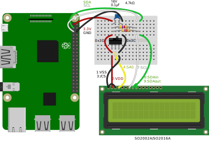
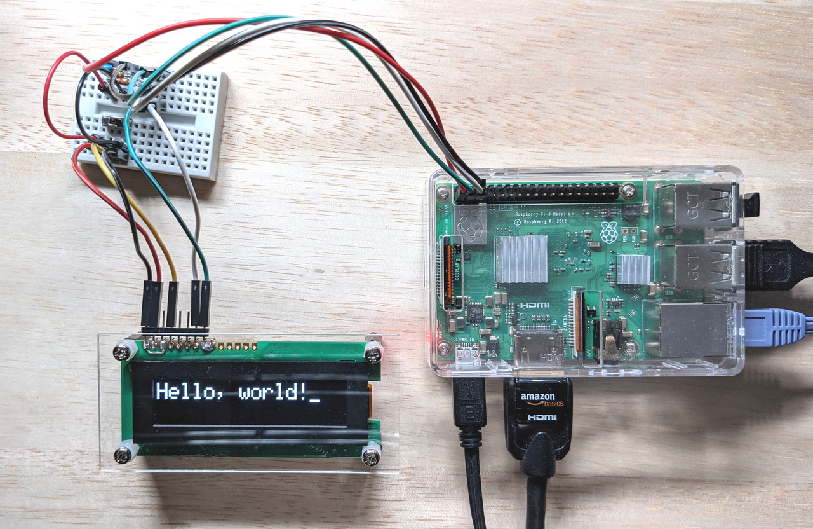

# Hello, world!
This example shows the simpliest usage of `Smdn.Devices.US2066`, how to display string to an OLED display module **SO1602A**.

You can run this example with following instruction.


## Prerequisites
Required devices and parts are as follows:

- Raspberry Pi
  - The model which .NET and `System.Device.Gpio` can run. Refer [this document](https://docs.microsoft.com/en-us/dotnet/iot/intro) for detail.
- SO1602A OLED display module and
  - 0.1μF capacitor × 1
  - 4.7kΩ resistor × 2
  - 3P slide switch × 1 (Optional. This switch is used to switching I<sup>2</sup>C address of SO1602A.)


## Wiring up
Wire up the devices and parts as shown in the wiring diagram below.



## Build and run project
Run command `dotnet build` to build project, or `dotnet run` to run project.

Note: If you want to use **SO2002A** instead of SO1602A, modify the code to use the class `SO2002A`.


## Hello, world!
If the project run properly, SO1602A shows the text `Hello, world!` like this: 




## Next step
To learn more usage of `Smdn.Devices.US2066`, see [exmaples](../) directory.


If you want to use `Smdn.Devices.US2066` in your project, create project and add package `Smdn.Devices.US2066` to the project.

```
dotnet new console --name your-project
cd your-project/
dotnet add package Smdn.Devices.US2066
```